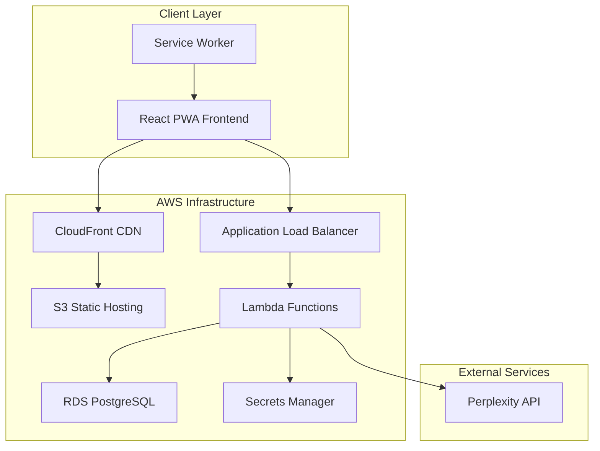

# Design Document

## Overview

The Lyrics Assistant is a full-stack Progressive Web Application consisting of a React frontend and NestJS backend. The application provides automatic lyrics scrolling functionality for musicians, with both online lyrics search and manual entry capabilities. The system is designed to be deployed on AWS within free tier constraints while following Twelve Factor App principles.

## Architecture

### High-Level Architecture



### Technology Stack

**Frontend:**
- React 18 with TypeScript
- Material-UI or Tailwind CSS for styling
- React Router for navigation
- React Query for state management and caching
- Workbox for PWA functionality

**Backend:**
- NestJS with TypeScript
- PostgreSQL database
- Drizzle ORM for database operations
- AWS Lambda for serverless deployment
- JWT for authentication (future enhancement)

**Infrastructure:**
- AWS S3 + CloudFront for frontend hosting
- AWS Lambda for backend API
- AWS RDS PostgreSQL (free tier)
- AWS Secrets Manager for API keys
- AWS CloudFormation for infrastructure as code

## Components and Interfaces

### Frontend Components

#### Core Components
1. **App Component**
   - Main application wrapper
   - Handles routing and global state
   - Manages PWA installation prompts

2. **SongsList Component**
   - Displays available songs in a list/grid format
   - Handles song selection and navigation
   - Includes search/filter functionality

3. **SongPage Component**
   - Displays song lyrics
   - Contains playback controls (Play, Stop, Pause, Config)
   - Manages auto-scroll functionality
   - Handles scroll configuration

4. **AddSong Component**
   - Form for adding new songs
   - Integrates with Perplexity API for lyrics search
   - Handles manual lyrics entry

5. **ConfigModal Component**
   - Modal for scroll configuration
   - Manages scroll delay and speed settings
   - Validates input ranges

#### Services
1. **ScrollService**
   - Manages automatic scrolling logic
   - Handles play/pause/stop functionality
   - Configurable speed and delay

2. **ApiService**
   - HTTP client for backend communication
   - Handles authentication headers
   - Error handling and retry logic

3. **PerplexityService**
   - Integration with Perplexity API
   - Lyrics search and parsing
   - Error handling for API failures

### Backend Components

#### Controllers
1. **SongsController**
   - CRUD operations for songs
   - Search functionality
   - Lyrics retrieval endpoints
   - Comprehensive Swagger documentation with examples

2. **LyricsController**
   - Perplexity API integration
   - Lyrics search and processing
   - Content filtering and validation
   - Detailed API documentation for search endpoints

3. **HealthController**
   - System health monitoring endpoints
   - Readiness and liveness checks
   - Documented monitoring endpoints for DevOps

#### Services
1. **SongsService**
   - Business logic for song management
   - Data validation and transformation
   - Database operations coordination

2. **LyricsSearchService**
   - Perplexity API integration
   - Prompt construction for lyrics search
   - Response parsing and cleaning

3. **ConfigService**
   - Environment configuration management
   - AWS services integration
   - Secrets management

#### Database Layer
1. **Drizzle Schema**
   - Type-safe database schema definitions
   - Migration management
   - Query builder integration

2. **SongsRepository**
   - Database operations for songs using Drizzle
   - Query optimization with Drizzle query builder
   - Data persistence layer

## Data Models

### Song Entity
```typescript
interface Song {
  id: string;
  title: string;
  author?: string;
  lyrics: string;
  scrollStartDelay: number; // seconds
  scrollSpeed: number; // 1-10 range
  createdAt: Date;
  updatedAt: Date;
}
```

### Scroll Configuration
```typescript
interface ScrollConfig {
  startDelay: number; // seconds
  speed: number; // 1-10 range
  isActive: boolean;
  isPaused: boolean;
}
```

### API Response Models
```typescript
interface ApiResponse<T> {
  success: boolean;
  data?: T;
  error?: string;
  message?: string;
}

interface LyricsSearchResponse {
  lyrics: string;
  source?: string;
  confidence: number;
}
```

### Database Schema

#### Drizzle Schema Definition
```typescript
import { pgTable, uuid, varchar, text, integer, timestamp, index } from 'drizzle-orm/pg-core';

export const songs = pgTable('songs', {
  id: uuid('id').primaryKey().defaultRandom(),
  title: varchar('title', { length: 255 }).notNull(),
  author: varchar('author', { length: 255 }),
  lyrics: text('lyrics').notNull(),
  scrollStartDelay: integer('scroll_start_delay').default(0).notNull(),
  scrollSpeed: integer('scroll_speed').default(5).notNull(),
  createdAt: timestamp('created_at').defaultNow().notNull(),
  updatedAt: timestamp('updated_at').defaultNow().notNull(),
}, (table) => ({
  titleIdx: index('idx_songs_title').on(table.title),
  authorIdx: index('idx_songs_author').on(table.author),
}));

export type Song = typeof songs.$inferSelect;
export type NewSong = typeof songs.$inferInsert;
```

#### SQL Migration
```sql
CREATE TABLE songs (
  id UUID PRIMARY KEY DEFAULT gen_random_uuid(),
  title VARCHAR(255) NOT NULL,
  author VARCHAR(255),
  lyrics TEXT NOT NULL,
  scroll_start_delay INTEGER DEFAULT 0 NOT NULL,
  scroll_speed INTEGER DEFAULT 5 NOT NULL CHECK (scroll_speed >= 1 AND scroll_speed <= 10),
  created_at TIMESTAMP DEFAULT CURRENT_TIMESTAMP NOT NULL,
  updated_at TIMESTAMP DEFAULT CURRENT_TIMESTAMP NOT NULL
);

CREATE INDEX idx_songs_title ON songs(title);
CREATE INDEX idx_songs_author ON songs(author);
```

## Error Handling

### Frontend Error Handling
1. **Network Errors**
   - Retry mechanism with exponential backoff
   - Offline mode detection and graceful degradation
   - User-friendly error messages

2. **Validation Errors**
   - Real-time form validation
   - Clear error messaging
   - Input sanitization

3. **API Errors**
   - HTTP status code handling
   - Error boundary components
   - Fallback UI states

### Backend Error Handling
1. **Global Exception Filter**
   - Centralized error handling
   - Structured error responses
   - Logging and monitoring

2. **Validation Pipes**
   - Input validation using class-validator
   - Custom validation rules
   - Sanitization of user input

3. **Database Errors**
   - Connection retry logic
   - Transaction rollback handling
   - Constraint violation handling

## API Documentation

### Swagger/OpenAPI Integration

The API uses Swagger/OpenAPI 3.0 for comprehensive documentation and interactive testing capabilities.

#### Documentation Features
1. **Interactive API Explorer**
   - Try-it-out functionality for all endpoints
   - Real-time request/response testing
   - Authentication token management

2. **Comprehensive Schema Documentation**
   - Detailed request/response models
   - Validation rules and constraints
   - Example data for all endpoints

3. **Error Response Documentation**
   - HTTP status codes with descriptions
   - Error response schemas
   - Rate limiting information

#### API Documentation Structure
```typescript
// Swagger Configuration
const swaggerConfig = {
  title: 'Lyrics Assistant API',
  description: 'RESTful API for the Lyrics Assistant application',
  version: '1.0.0',
  tags: [
    { name: 'songs', description: 'Song management endpoints' },
    { name: 'lyrics', description: 'Lyrics search endpoints' },
    { name: 'health', description: 'Health check endpoints' }
  ],
  servers: [
    { url: 'http://localhost:3001/api/v1', description: 'Development' },
    { url: 'https://api.lyrics-assistant.com/api/v1', description: 'Production' }
  ]
};
```

#### Endpoint Documentation Examples
```typescript
// Songs endpoint documentation
@ApiOperation({
  summary: 'Get all songs',
  description: 'Retrieve a list of all songs with metadata'
})
@ApiResponse({
  status: 200,
  description: 'Successfully retrieved songs',
  schema: { /* detailed schema */ }
})

// Lyrics search endpoint documentation
@ApiBody({
  description: 'Search parameters for lyrics lookup',
  schema: {
    type: 'object',
    required: ['title'],
    properties: {
      title: { type: 'string', example: 'Amazing Grace' },
      author: { type: 'string', example: 'John Newton' }
    }
  }
})
```

## Testing Strategy

### API Testing
1. **Swagger UI Testing**
   - Interactive endpoint testing
   - Request/response validation
   - Authentication flow testing

2. **Documentation Validation**
   - Schema validation against actual responses
   - Example data accuracy verification
   - Error response documentation testing

### Frontend Testing
1. **Unit Tests**
   - Component testing with React Testing Library
   - Service layer testing with Jest
   - Mock external dependencies

2. **Integration Tests**
   - API integration testing
   - User flow testing
   - PWA functionality testing

3. **E2E Tests**
   - Cypress for critical user journeys
   - Cross-browser compatibility
   - Mobile responsiveness testing

### Backend Testing
1. **Unit Tests**
   - Service layer testing
   - Repository testing with Drizzle and test database
   - Mock external API calls

2. **Integration Tests**
   - API endpoint testing
   - Database integration testing
   - External service integration

3. **Performance Tests**
   - Load testing for API endpoints
   - Database query optimization
   - Memory usage monitoring

### PWA Testing
1. **Offline Functionality**
   - Service worker testing
   - Cache strategy validation
   - Offline data synchronization

2. **Installation Testing**
   - PWA installation prompts
   - App manifest validation
   - Icon and splash screen testing

## Security Considerations

### Frontend Security
1. **Content Security Policy (CSP)**
   - Strict CSP headers
   - Nonce-based script execution
   - XSS prevention

2. **Input Sanitization**
   - HTML sanitization for lyrics content
   - URL validation for external links
   - File upload restrictions (future enhancement)

### Backend Security
1. **API Security**
   - Rate limiting
   - Input validation and sanitization
   - CORS configuration

2. **Data Protection**
   - Environment variable management
   - Secrets rotation
   - Database connection security

3. **AWS Security**
   - IAM roles and policies
   - VPC configuration
   - Security groups and NACLs

## Performance Optimization

### Frontend Performance
1. **Code Splitting**
   - Route-based code splitting
   - Component lazy loading
   - Bundle size optimization

2. **Caching Strategy**
   - Service worker caching
   - Browser caching headers
   - API response caching

3. **Rendering Optimization**
   - Virtual scrolling for large lyrics
   - Debounced scroll events
   - Memoization of expensive calculations

### Backend Performance
1. **Database Optimization**
   - Drizzle query builder optimization
   - Connection pooling with pg-pool
   - Indexing strategy for search operations

2. **API Optimization**
   - Response compression
   - Pagination for large datasets
   - Efficient serialization

3. **AWS Optimization**
   - Lambda cold start optimization
   - CloudFront caching
   - RDS performance insights

## Deployment Architecture

### AWS Free Tier Compliance
1. **Compute Resources**
   - AWS Lambda (1M requests/month free)
   - Alternative: EC2 t2.micro (750 hours/month free)

2. **Storage**
   - S3 (5GB free storage)
   - RDS PostgreSQL (20GB free storage)

3. **Network**
   - CloudFront (1TB data transfer free)
   - Application Load Balancer (750 hours free)

### Infrastructure as Code
```yaml
# CloudFormation template structure
Resources:
  FrontendBucket:
    Type: AWS::S3::Bucket
    Properties:
      WebsiteConfiguration:
        IndexDocument: index.html
  
  CloudFrontDistribution:
    Type: AWS::CloudFront::Distribution
    Properties:
      DistributionConfig:
        Origins:
          - DomainName: !GetAtt FrontendBucket.DomainName
  
  LambdaFunction:
    Type: AWS::Lambda::Function
    Properties:
      Runtime: nodejs18.x
      Handler: main.handler
  
  RDSInstance:
    Type: AWS::RDS::DBInstance
    Properties:
      DBInstanceClass: db.t3.micro
      Engine: postgres
```

### Environment Configuration
1. **Local Development Environment**
   - Local PostgreSQL database (Docker or native installation)
   - NestJS development server with hot reload
   - React development server with hot reload
   - Drizzle Studio for database management
   - Mock Perplexity API responses for testing
   - Environment variables for local configuration

2. **Production Environment**
   - AWS RDS PostgreSQL
   - Lambda deployment with Serverless Framework
   - CloudFront distribution for React app
   - Real Perplexity API integration
   - AWS Secrets Manager for sensitive configuration

### Local Development Setup
1. **Prerequisites**
   - Node.js 18+ and npm/yarn
   - PostgreSQL 14+ (Docker recommended)
   - Git for version control

2. **Database Setup**
   ```bash
   # Using Docker
   docker run --name lyrics-db -e POSTGRES_PASSWORD=password -e POSTGRES_DB=lyrics_assistant -p 5432:5432 -d postgres:14
   
   # Run Drizzle migrations
   npm run db:migrate
   
   # Optional: Seed database
   npm run db:seed
   ```

3. **Development Workflow**
   ```bash
   # Backend development
   cd backend
   npm run start:dev
   
   # Frontend development (separate terminal)
   cd frontend
   npm run dev
   
   # Database management
   npm run db:studio  # Opens Drizzle Studio
   ```

### Monitoring and Logging
1. **Application Monitoring**
   - AWS CloudWatch for Lambda metrics
   - Error tracking and alerting
   - Performance monitoring

2. **User Analytics**
   - Basic usage analytics
   - Error reporting
   - Performance metrics

This design provides a scalable, maintainable architecture that meets all the functional and non-functional requirements while staying within AWS free tier limits and following Twelve Factor App principles.